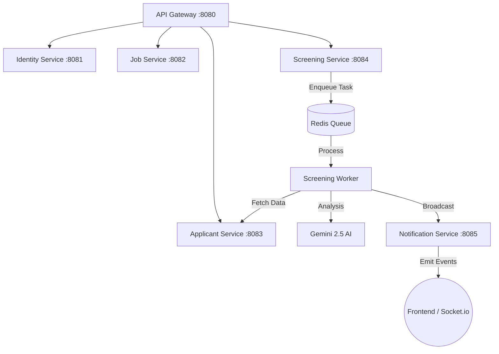

# UmuravaLens Backend

UmuravaLens is a state-of-the-art recruitment platform backend built on a **microservices architecture**. It leverages **Generative AI (Gemini 2.5 Flash)** to automate applicant screening, resume parsing, and multimodal document verification with real-time observability.

---

## 🛠 Tech Stack

- **Runtime**: Node.js & TypeScript
- **Framework**: Express.js
- **Microservices**: Monorepo orchestration via NPM Workspaces
- **Databases**: MongoDB (Per-service isolation)
- **Messaging**: Redis + BullMQ (Asynchronous Task Processing)
- **AI Engine**: Google Gemini 2.5 Flash (Multimodal)
- **Communication**: REST (HTTP/JSON), WebSockets (Socket.io)
- **API Documentation**: OpenAPI (Swagger) & AsyncAPI (WebSockets)
- **DevOps**: Docker, Docker Compose

---

## 🏗 System Architecture

UmuravaLens follows a strictly decoupled microservices pattern:



---

## 🤖 AI Screening Pipeline

The core "engine" of UmuravaLens is its automated, multimodal screening pipeline.

### 1. Data Aggregation
The pipeline aggregates a "360-degree" view of the candidate:
- **Core Profile**: Extracted skills, bio, and experience timeline.
- **Multimodal Assets**: Binary files like Portfolios (PDF/Images), Project Samples, and Certifications.
- **Job Context**: The specific requirements and the recruiter-defined `shortlist` threshold.

### 2. Analysis Flow
- **Worker Execution**: Background tasks are processed with a **5-attempt Exponential Backoff** retry policy to ensure 99.9% availability.
- **multimodal Reasoning**: Gemini analyzes visual evidence (e.g., UI designs in a portfolio) alongside textual claims.
- **Scoring**: A match score (0-100) is generated based on core tech stack alignment and experience depth.
- **Commentary**: AI generates a strictly monitored **200-300 word professional analysis** justifying its decision.

### 3. Real-time Monitoring
Recruiters can watch the analysis happen live. The **Notification Service** emits:
- `screening_progress`: percentage, finished/total counts, and current job status.
- `screening_finished`: Final results summary and confirmation of the automated recruiter email.

---

## 📡 API & Documentation

| Source | Documentation URL | Description |
| :--- | :--- | :--- |
| **REST API** | `http://localhost:8080/docs` | Interactive Swagger UI for all recruitment and identity routes. |
| **WebSockets** | `http://localhost:8080/docs/asyncapi` | Interactive AsyncAPI UI for real-time event schemas. |
| **Raw JSON** | `http://localhost:8080/api/v3` | Raw OpenAPI v3 specification. |

### Core Endpoints

#### 🔐 Identity & Auth
- `POST /auth/login` | Recruiter authentication.
- `GET /auth/me` | Fetch authenticated user with notification preferences.
- `GET /sources` | Manage candidate traffic sources (LinkedIn, Job Boards, etc.).

#### 💼 Jobs
- `POST /jobs` | Create vacancy with mandatory skills and shortlist threshold.
- `POST /jobs/:id/publish` | Switch job from Draft to Published status.

#### 📄 Applicants
- `POST /applicants/apply` | Primary endpoint for candidate applications + file uploads.
- `GET /applicants?jobId=...` | List and filter applicants by job, source, or verification status.
- `POST /applicants/verify/:id` | Human-in-the-loop verification of candidate data.

#### 📊 Screening
- `POST /screenings/run` | Trigger AI analysis for a job's entire applicant pool.
- `POST /screenings/:id/stop` | Immediate halt of a running analysis task.
- `GET /screenings/:id/results` | Detailed AI report with match scores and commentary.

---

## 🚀 Getting Started

### Prerequisites
- Docker & Docker Compose
- Node.js (v20+)
- Google Gemini API Key

### Installation

1. **Clone & Config**:
   ```bash
   cp .env.example .env
   # Add your GEMINI_API_KEY to the .env
   ```

2. **Launch with Docker**:
   ```bash
   docker-compose up --build
   ```

3. **Local Dev Mode**:
   ```bash
   npm install
   # Run all microservices concurrently
   npm run dev
   ```

---

## 🔒 Security & Performance

- **Service Isolation**: Each service has its own MongoDB instance to prevent cross-service database coupling.
- **Gateway Validation**: Strict file type filtering (PDF, PNG, JPEG, WebP, HEIC) enforced at the entry point.
- **Rate Limiting**: AI prompts are protected by internal queuing to prevent API throttling.
- **Centralized Logging**: Unified Winston-based logging across all seven microservices.

